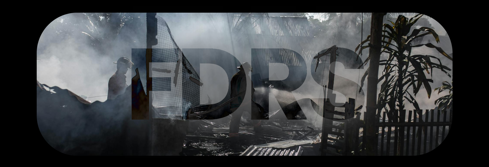
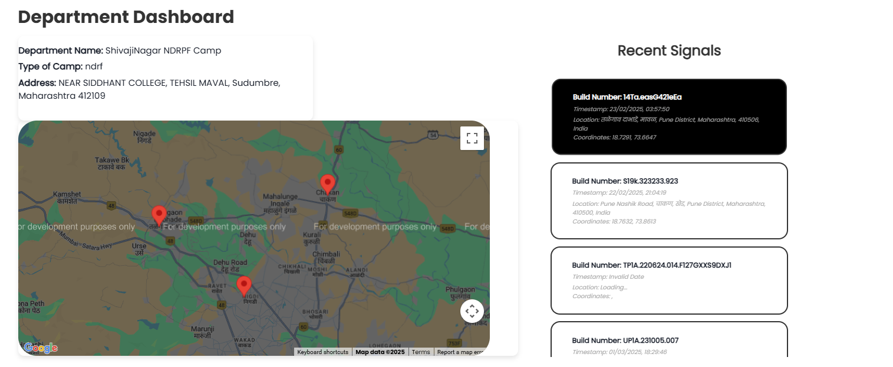
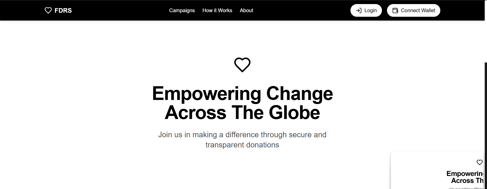
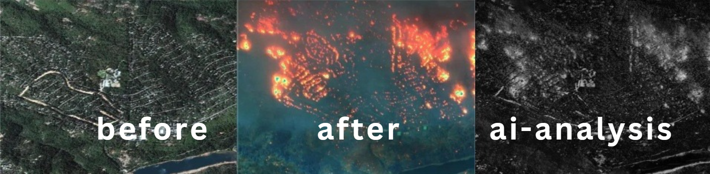

# 🌍 FDRS – Falcons Disaster Response System

---

## 🚨 Overview

FDRS (Falcons Disaster Response System) is a robust and scalable solution designed to streamline the management and coordination of disaster relief across multiple government departments. It enables affected citizens to trigger instant SOS alerts and allows authorities to coordinate actions through a centralized platform, integrated with AI-powered tools and blockchain-backed donation systems.

FDRS was created to solve real-world challenges during natural or man-made disasters by enabling transparent, secure, and real-time communication between civilians and government agencies.

---

## 🔑 Key Features

### 🆘 SOS Alert System

- Users can send emergency alerts via Android mobile app or web portal.
- Alerts can be triggered manually or automatically (e.g., through geolocation triggers).
- Each alert includes the user’s live location and other metadata to help responders prioritize.

### 🏢 Multi-Agency Coordination

- Centralized dashboard for organizations like:
  - NDRF (National Disaster Response Force)
  - CRPF (Central Reserve Police Force)
  - Local Police Stations
  - Fire Brigades
  - Hospitals
- Enables quick routing of alerts to relevant departments and zones.

### 🪙 Blockchain-Powered Donations

- Transparent donation system powered by smart contracts.
- Publicly verifiable transactions to prevent corruption and fund misuse.
- Donors can track where and how their contributions are being used.

### 🤖 AI-Powered Disaster Assistance

- AI models analyze SOS density, location data, and user inputs to guide rescue operations.
- Multilingual chatbot for user queries during crises.
- Generates priority-based rescue plans and resource deployment recommendations.

  

### 📊 Environmental Impact & Relief Analysis

- Real-time dashboard with damage assessment reports.
- Predictive analytics for potential aftershocks, flooding zones, and spread zones.
- Data-driven resource allocation to optimize recovery efforts.

  

---

## 🌐 Live Demo

Try out the platform here:  
**Web**: [https://fdrs.vercel.app](https://fdrs.vercel.app)

**Test Credentials**  
Email: `test@gmail.com`  
Password: `testadmin`

---

## 🧠 Technologies Used

### 🖥️ Frontend

- **React.js**: For building dynamic and responsive interfaces in the admin dashboard and public-facing platform.
- **Android (Kotlin/Java)**: Native mobile app for SOS signal generation, location access, and real-time notifications.

### ⚙️ Backend

- **Firebase (Firestore + Auth)**: Real-time cloud database and authentication system to manage users, alerts, and departments securely.
- **Node.js (Cloud Functions)**: Handles backend logic, automation, and real-time communication between users and authorities.

### 🔐 Blockchain

- **Solidity**: Smart contracts developed to ensure transparent, tamper-proof tracking of relief donations.
- **Web3.js**: Connects frontend applications to Ethereum contracts, enabling users to donate and verify funds on-chain.

### 🤖 AI/ML Modules

- **Python (NLP + AI)**: Used for multilingual support, disaster analysis, and alert processing.
- **Disaster Intelligence Engine**: Recommends optimized rescue paths and analyzes alert clusters in real time.

### 🗺️ Maps & GPS

- **Google Maps API**: For real-time visualization of user locations, alert mapping, and route planning.
- **Mobile Location Services**: Embedded in the Android app for accurate SOS geo-tagging.

### 🚀 Deployment

- **Vercel**: Hosting and CI/CD for the web client.
- **Firebase Hosting**: Serverless deployment for backend and mobile APIs.
- **Google Play Store (Planned)**: Upcoming distribution channel for the Android app.

---

## 🤝 Contributing

We welcome contributions!  
To contribute:

1. Fork the repository
2. Create a new branch (`git checkout -b feature-name`)
3. Make your changes and commit (`git commit -m 'Add feature'`)
4. Push to your branch (`git push origin feature-name`)
5. Open a Pull Request

---

## ⚠️ Disclaimer

FDRS is a **prototype** project built for demonstration and research. For real-world deployment, official partnerships, legal compliance, and verified data integrations are required.

---

## 👨‍💻 Authors & Contributors

- **Sarthak Patil**  
  GitHub: [https://github.com/Precise-Goals](https://github.com/Precise-Goals)

- **Gaurav Chaudhari**  
  GitHub: [https://github.com/Chgauravpc](https://github.com/Chgauravpc)

- **Satyam Singh**  
  GitHub: [https://github.com/SATYAM-KS](https://github.com/SATYAM-KS)

---

## 📬 Contact

Email: **sarthakpatil.ug@gmail.com**  
Project Repo: [https://github.com/Precise-Goals/Complete-FDRS](https://github.com/Precise-Goals/Complete-FDRS)

## ❤️‍🔥 Made with dedication and Collaboration for Techathon :)

